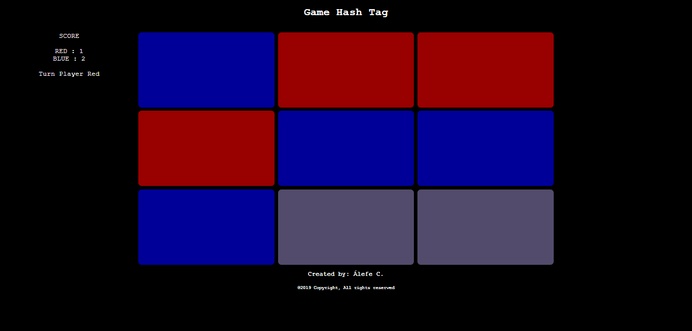

# Game HashTag



# About the APP

The idea this app is:

"A game of Hashtag for two players"

# why?

Project using Node.js, Express.js, Angularjs and CSS Pure(GRID)


# Getting Started

### Prerequisites

For run this project in develpment mode, you will need to have Nodejs installed,that can be found [here](https://nodejs.org/en/).

# Installing

### Cloning the repository

```sh
$ git https://gitlab.com/alefecrz/hash-tag.git
$ cd hash-tag
$ npm i
```

# Running

```sh
$ node index.js

after, open your browser and digit in URL 
http://localhost:3000/
```


